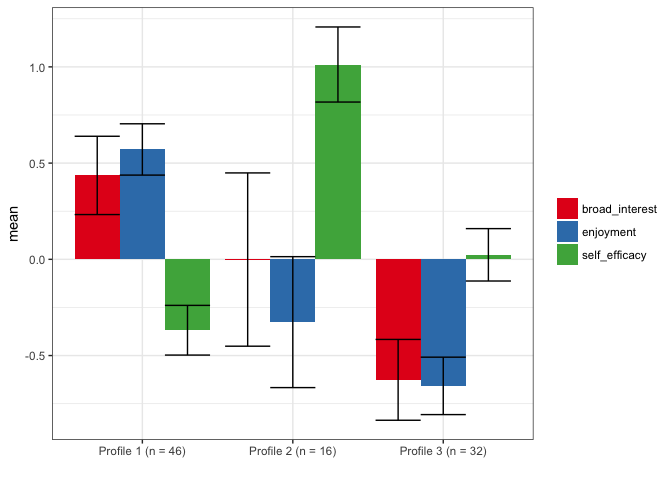

<!-- README.md is generated from README.Rmd. Please edit that file -->
tidyLPA
=======

The goal of `tidyLPA` is to provide tools to make it easier to use the `R` package [MCLUST](http://www.stat.washington.edu/mclust/) for Latent Profile Analysis analyses.

This is a sister-project to [prcr](https://github.com/jrosen48/prcr), for two-step cluster analysis. tidyLPA (which, again, is an interface to the `MCLUST` package) has been benchmarked to MPlus, at least for a simple dataset (the [iris dataset](https://en.wikipedia.org/wiki/Iris_flower_data_set)). You can find the results of that benchmarking, which showed the results to be nearly, identical, [here](https://jrosen48.github.io/blog/comparing-mplus-and-mclust-output/).

Installation
------------

You can install tidyLPA from github with:

``` r
# install.packages("devtools")
devtools::install_github("jrosen48/tidymixmod")
```

Example
=======

Here is a brief example using the built-in `pisaUSA15` dataset and variables for broad interest, enjoyment, and self-efficacy. See `?create_profiles_lpa` for more details.

Also, please view the [Introduction to tidyLPA vignette](https://jrosen48.github.io/tidyLPA/articles/Introduction_to_tidyLPA.html) for more information.

``` r
library(tidyLPA)
```

``` r
library(dplyr, warn.conflicts = FALSE)
d <- sample_n(pisaUSA15, 200)
m3 <- create_profiles_lpa(d, broad_interest, enjoyment, self_efficacy, n_profiles = 3, model = 2)
#> Fit varying means, equal variances and covariances (Model 2) model with 3 profiles.
#> AIC is 1143.054
#> BIC is 1198.074
#> ICL is 1213.502
#> Entropy is 0.96503
plot_profiles_lpa(m3)
```


