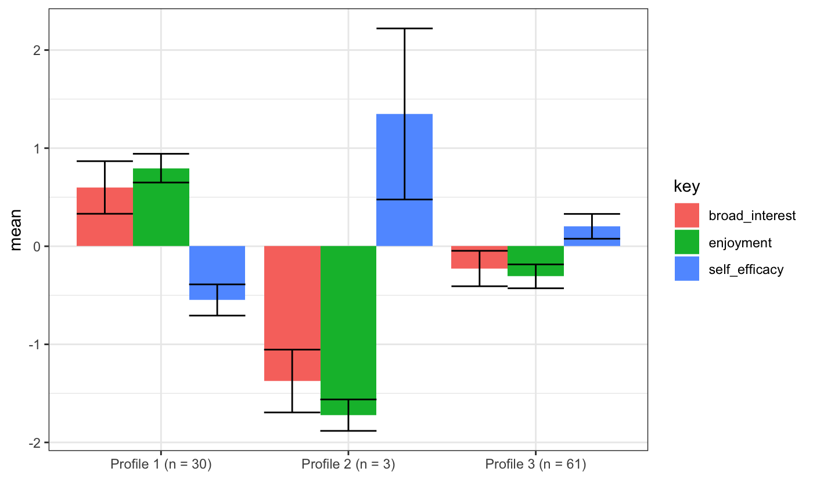

<!-- README.md is generated from README.Rmd. Please edit that file -->
[](https://travis-ci.org/jrosen48/tidyLPA) [](https://cran.r-project.org/package=tidyLPA) [](https://cran.r-project.org/package=tidyLPA) [](https://www.tidyverse.org/lifecycle/#maturing)

Background
----------

Latent Profile Analysis (LPA) is a statistical modeling approach for estimating distinct profiles, or groups, of variables. In the social sciences and in educational research, these profiles could represent, for example, how different youth experience dimensions of being engaged (i.e., cognitively, behaviorally, and affectively) at the same time.

tidyLPA provides the functionality to carry out LPA in R. In particular, tidyLPA provides functionality to specify different models that determine whether and how different parameters (i.e., means, variances, and covariances) are estimated and to specify (and compare solutions for) the number of profiles to estimate.

Installation
------------

You can install tidyLPA (v. `0.2.0`) from CRAN with:

``` r
install.packages("tidyLPA")
```

You can also install the development version (v. `0.2.1`) of tidyLPA from GitHub with:

``` r
install.packages("devtools")
devtools::install_github("jrosen48/tidyLPA")
```

Example
-------

Here is a brief example using the built-in `pisaUSA15` data set and variables for broad interest, enjoyment, and self-efficacy. Note that we first type the name of the data frame, followed by the unquoted names of the variables used to create the profiles. We also specify the number of profiles and the model. See `?estimate_profiles` for more details.

``` r
library(tidyLPA)
```

``` r
d <- pisaUSA15[1:100, ]

estimate_profiles(d, 
                  broad_interest, enjoyment, self_efficacy, 
                  n_profiles = 3)
#> Fit NA model with 3 profiles.
#> LogLik is 283.991
#> BIC is 631.589
#> Entropy is 0.914
#> # A tibble: 94 x 5
#>    broad_interest enjoyment self_efficacy profile posterior_prob
#>             <dbl>     <dbl>         <dbl> <fct>            <dbl>
#>  1            3.8       4            1    1                1.000
#>  2            3         3            2.75 3                0.917
#>  3            1.8       2.8          3.38 3                0.997
#>  4            1.4       1            2.75 2                0.899
#>  5            1.8       2.2          2    3                0.997
#>  6            1.6       1.6          1.88 3                0.997
#>  7            3         3.8          2.25 1                0.927
#>  8            2.6       2.2          2    3                0.990
#>  9            1         2.8          2.62 3                0.998
#> 10            2.2       2            1.75 3                0.996
#> # ... with 84 more rows
```

The version of this function that uses MPlus is simple `estimate_profiles_mplus()` that is called in the same way (though some particular details can be changed with arguments specific to either `estimate_profiles` or to `estimate_profiles_mplus()`).

See the output is simply a data frame with the profile (and its posterior probability) and the variables used to create the profiles (this is the "tidy" part, in that the function takes and returns a data frame).

We can plot the profiles with by *piping* (using the `%>%` operator, loaded from the `dplyr` package) the output to `plot_profiles()`.

``` r
library(dplyr, warn.conflicts = FALSE)

estimate_profiles(d, 
                  broad_interest, enjoyment, self_efficacy, 
                  n_profiles = 3) %>% 
    plot_profiles(to_center = TRUE)
```



Model specification
-------------------

In addition to the number of profiles (specified with the `n_profiles` argument), the model can be specified in terms of whether and how the variable variances and covariances are estimated.

The models are specified by passing arguments to the `variance` and `covariance` arguments. The possible values for these arguments are:

-   `variances`: "equal" and "zero"
-   `covariances`: "varying", "equal", and "zero"

If no values are specified for these, then the equal variances and covariances fixed to 0 model is specified by default.

These arguments allow for four models to be specified:

-   Equal variances and covariances fixed to 0 (Model 1)
-   Varying variances and covariances fixed to 0 (Model 2)
-   Equal variances and equal covariances (Model 3)
-   Varying variances and varying covariances (Model 6)

Two additional models (Models 4 and 5) can be fit using functions that provide an interface to the MPlus software. More information on the models can be found in the [vignette](https://jrosen48.github.io/tidyLPA/articles/Introduction_to_tidyLPA.html).

Here is an example of specifying a model with varying variances and covariances (Model 6; not run here):

``` r
estimate_profiles(d, 
                  broad_interest, enjoyment, self_efficacy, 
                  variances = "varying",
                  covariances = "varying",
                  n_profiles = 3)
```

Comparing a wide range of solutions
-----------------------------------

The function `compare_solutions()` estimates models with varying numbers of profiles and model specifications:

``` r
compare_solutions(d, broad_interest, enjoyment, self_efficacy)
```

The version that uses MPlus - `compare_solutions_mplus()` - is called in the same way; like for `estimate_profiles()` and `estimate_profiles_mplus()`, some particular details can be specified with arguments specific to `compare_solutions()` or `compare_solutions_mplus()`.

More information
----------------

To learn more:

-   Browse the tidyLPA [website](https://jrosen48.github.io/tidyLPA/) (especially check out the Reference page to see more about other functions)

-   *Read the Introduction to tidyLPA* [vignette](https://jrosen48.github.io/tidyLPA/articles/Introduction_to_tidyLPA.html), which has much more information on the models that can be specified with tidyLPA and on additional functionality

Contributing and Contact Information
------------------------------------

One of the easiest but also most important ways to contribute is to post a question or to provide feedback. Both positive *and* negative feedback is welcome and helpful. You can get in touch by . . .

-   Sending a message via <tidylpa@googlegroups.com> or view the [the tidyLPA group page](https://groups.google.com/forum/#!forum/tidylpa) (*preferred*)
-   Filing an issue on GitHub [here](https://github.com/jrosen48/tidyLPA)

Contributions are also welcome via by making pull requests (PR), e.g. through [this page on GitHub](https://github.com/jrosen48/tidyLPA/pulls). It may be easier if you first file an issue outlining what you will do in the PR. You can also reach out via the methods described above.

Please note that this project is released with a [Contributor Code of Conduct](CONDUCT.md). By participating in this project you agree to abide by its terms.
